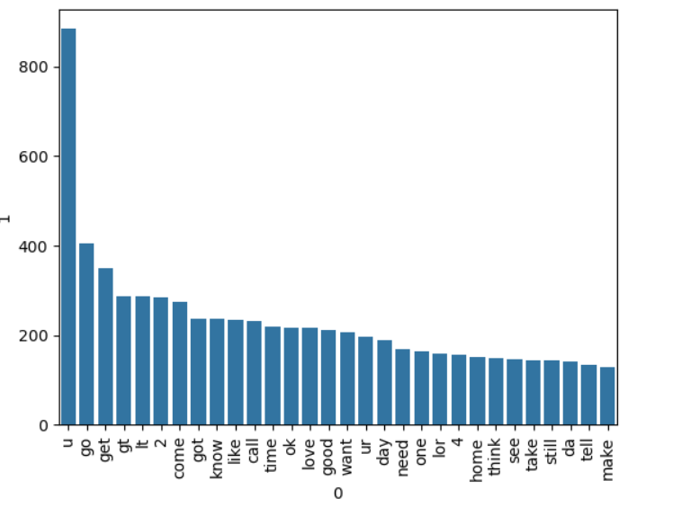
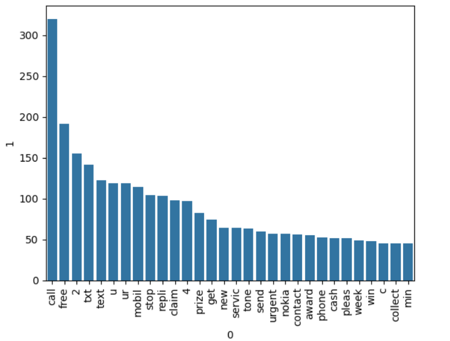
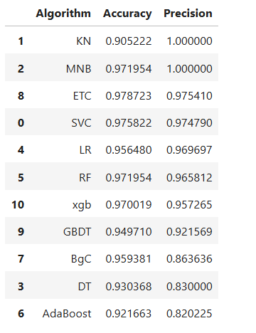
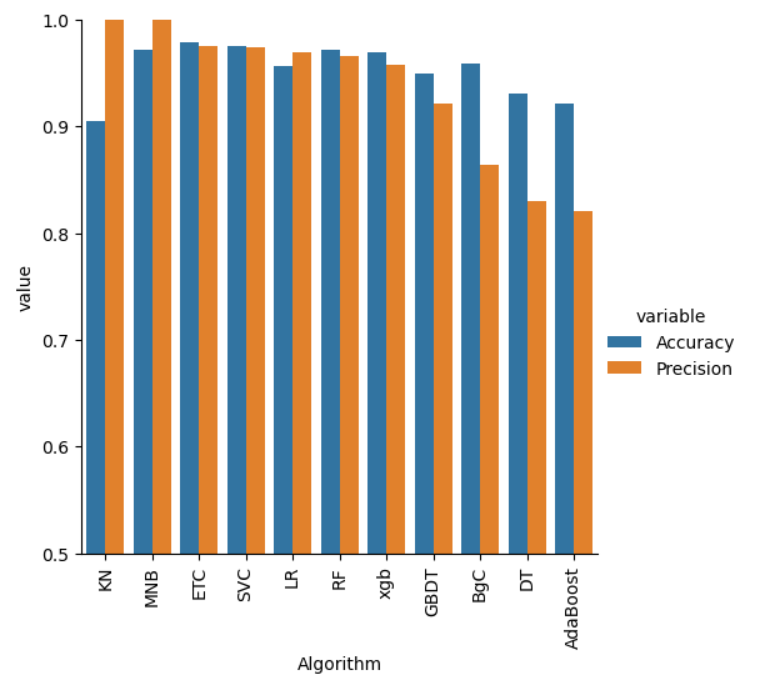
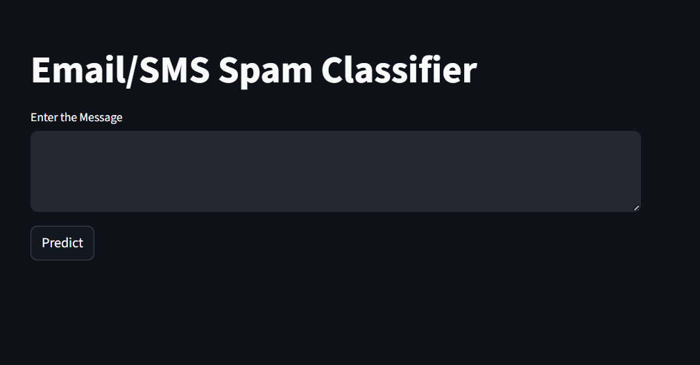

# Message Spam Classifier

This project implements a Machine Learning-based Spam Classifier using Multinomial Naive Bayes to identify and filter spam messages. The model achieves high accuracy and very high precision, ensuring reliable detection of spam.

## Most Frequent Ham Word

## Most Frequent Spam Word

## Precision vs Accuracy of Different Model

SVC : Support Vector Classifier

KN : K-Nearest Neighbors Classifier

MNB : Multinomial Naive Bayes

DT : Decision Tree Classifier

LR : Logistic Regression

RF : Random Forest Classifier

AdaBoost : Adaptive Boosting Classifier

BgC : Bagging Classifier

ETC : Extra Trees Classifier

GBDT : Gradient Boosting Decision Tree

xgb : Extreme Gradient Boosting

## Precision vs Accuracy of Different Model 

## Home Page

## predicted output
